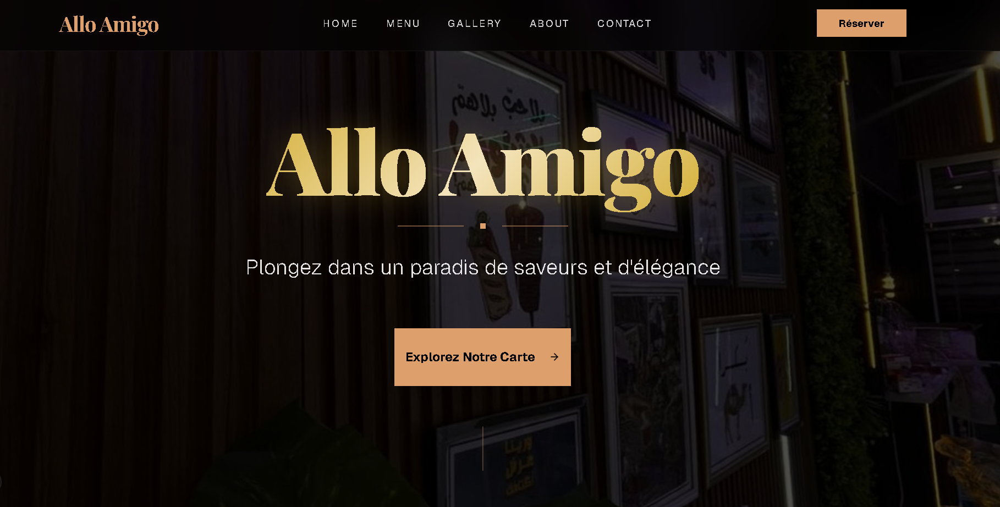
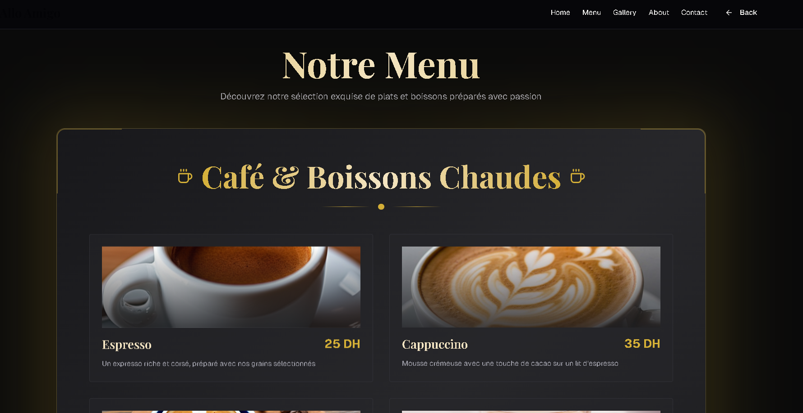
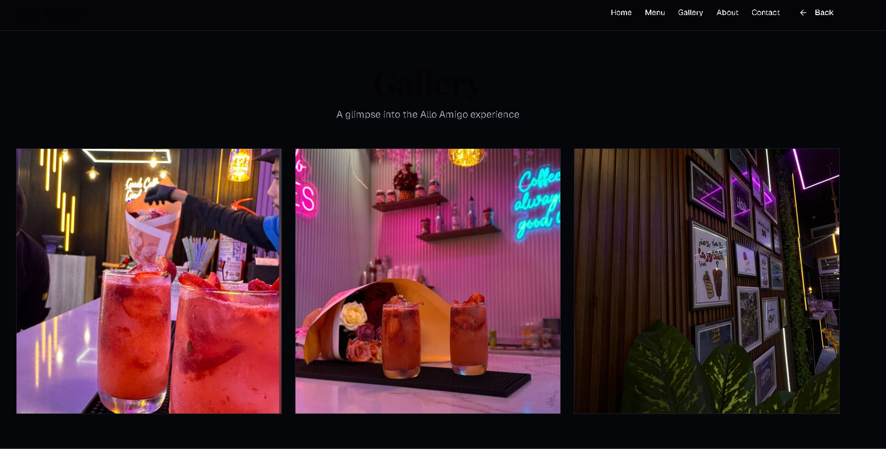
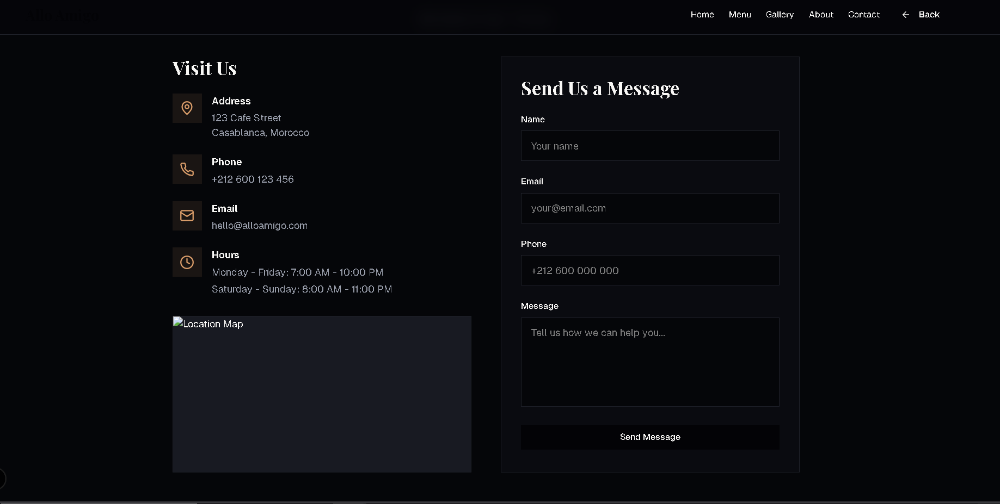

# 🍽️ Restaurant Website

A modern and responsive restaurant website built to showcase the menu, services, and brand identity of a restaurant in a clean and professional way.

---

## 📸 Screenshots

> Screenshots of the project interface






---

## 🚀 Features

- Responsive design (Desktop / Tablet / Mobile)
- Modern UI with clean layout
- Menu presentation
- Contact section
- Fast and optimized performance
- Easy to customize

---


---


---

## ⚙️ Installation & Setup

1. Clone the repository:
```bash
git clone https://github.com/meriemeouasif/restaurant-website.git

